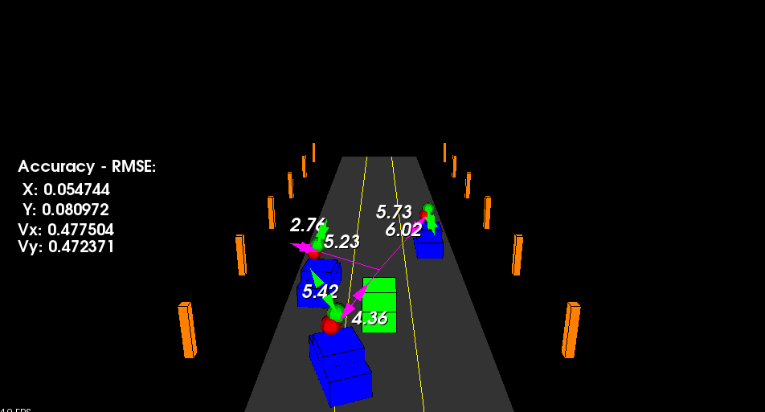

# Vehicle tracking with radar and lidar
Contains vehicle tracking implementation using Kalman filters to fusion radar and lidar data

Vehicle tracking and state estimation
- PCL for LIDAR signals.
- Constant Turn Rate and Velocity magnitude model (CTRV).
- Position and velocity estimation with unscented kalman filters.

We can see state estimation of the 3 blue vehicles (position and velocity) in the following picture:

The red spheres represents the ground truth position and the green ones represent the estimated position.
The numbers on the left correspond only to one of the vehicles.s

## Dependencies
* cmake >= 3.5
* make >= 4.1 
* gcc/g++ >= 5.4
* PCL >= 1.2

## Basic Build Instructions

1. Clone this repo.
2. Make a build directory in the top level project directory: `mkdir build && cd build`
3. Compile: `cmake .. && make`
4. Run it:

		./vehicle_tracking

